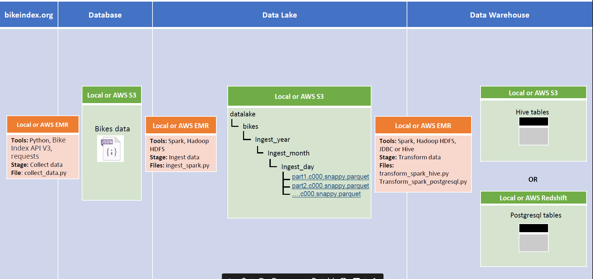
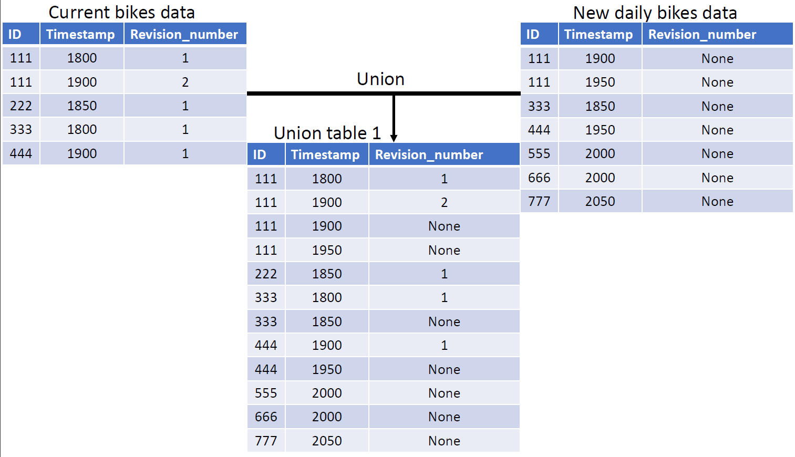
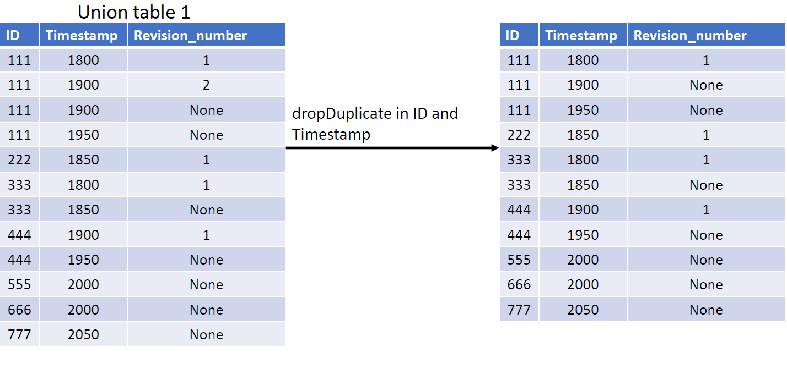
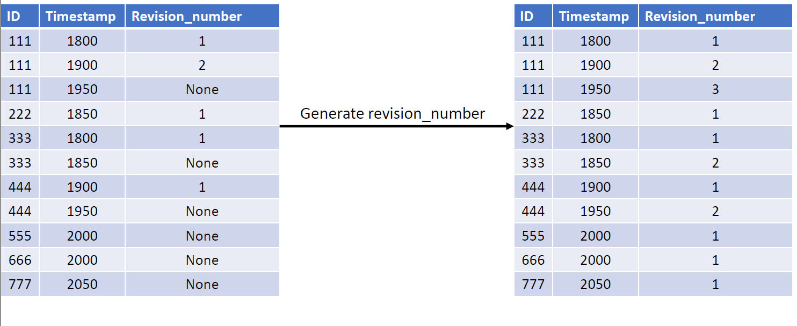
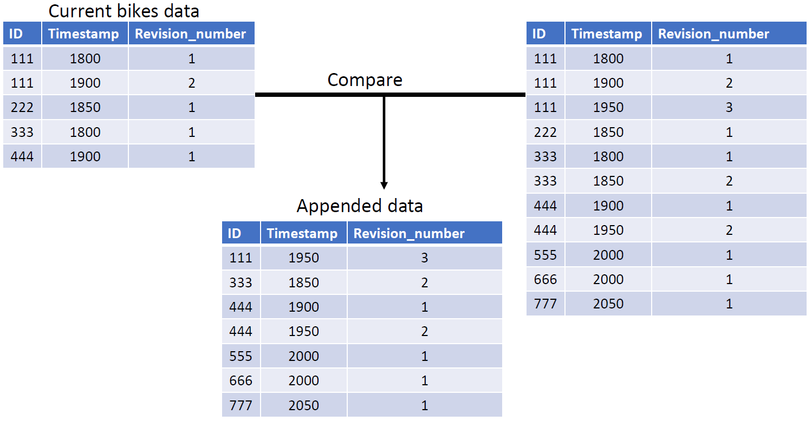
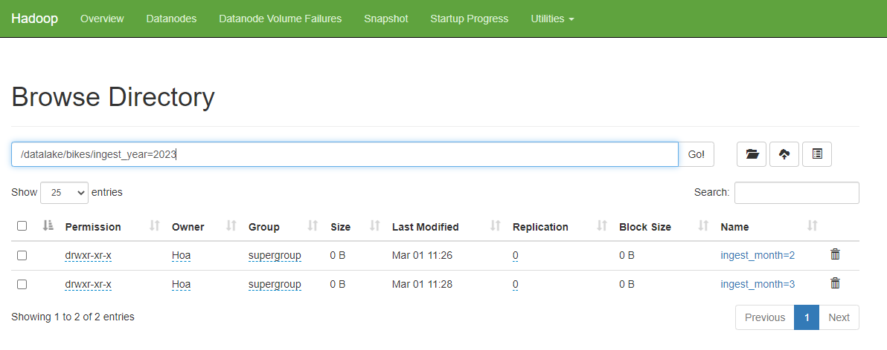
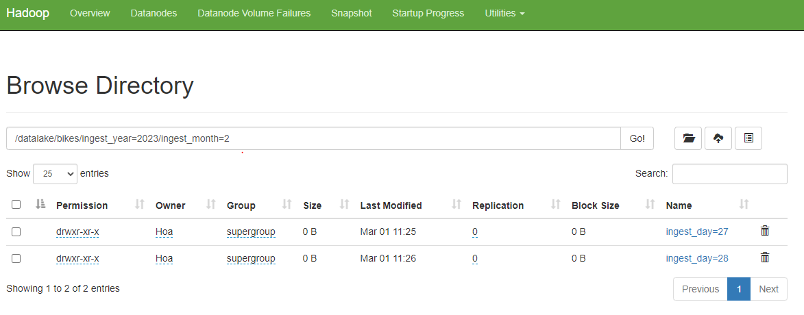
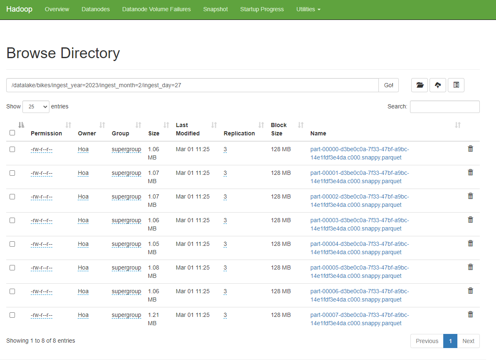
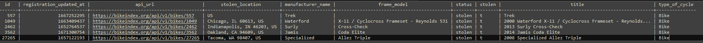

# Project summary
## Introduction
The project is ingesting daily bikes data from `https://bikeindex.org/` and storing these data in the Bigdata-friendly 
format. In addition, provide a design to keep tracking all records' versions.

## Project structure
 
The project includes Project configuration `prj-config.cfg` to store all configurations for JDBC, Hadoop, Postgresql DB, 
AWS, and Bike Index API V3. 

`collect_data.py` collects data from `https://bikeindex.org/` and stores it temporary 
in JSON files.

`ingest_spark.py` ingests the JSON files and stores them in HDFS in parquet file format.

`transform_spark_hive.py` or `transform_spark_postgresql.py` transforming the parquet files in HDFS and storing 
transformed data into Postgresql DB or Hive tables.

`create_postgresql_db.py` creates GSG database and tables in Postgresql.


## Data architecture


# Explanation for storing new daily bikes data





# Sample run
## Step 1: Start Hadoop

## Step 2: Clarify HDFS path, GSG Database, JAR file path for JDBC driver configuration
```buildoutcfg
[bike_url]
bikes = https://bikeindex.org:443/api/v3/search
op_bike = https://bikeindex.org:443/api/v3/bikes/{}

[hadoop_config]
host = 
port = 

[postgresql_default]
host = 
dbname = 
user = 
password = 

[postgresql_gsg]
host = 
dbname = gsg
user = 
password = 

[jdbc_jar]
jdbc_jar = 
```

## Step 3: Collect bike data from `https://bikeindex.org/`
```commandline
python collect_data.py
```

## Step 4: Ingest data
For sample, I prepared 3 folders to simulate daily data ingestion `~/database/2022-2-27`, `~/database/2022-2-28`, and
`~/database/2022-3-1`
```commandline
python ingest_spark.py -d 2023-2-27 -p ~\gsg-casestudy\src\database\2022-02-27
python ingest_spark.py -d 2023-2-28 -p ~\gsg-casestudy\src\database\2022-02-28
python ingest_spark.py -d 2023-3-1 -p ~\gsg-casestudy\src\database\2022-03-01
```
As result of above command lines, it will reflect in Hadoop HDFS 




## Step 5: Transform data
Create GSG database and bikes table
```commandline
python create_postgresql_db.py
```

Transform and load latest bike data table
```commandline
python transform_spark_postgresql.py
```
As result of above command lines, it will reflect in gsg postgres DB

